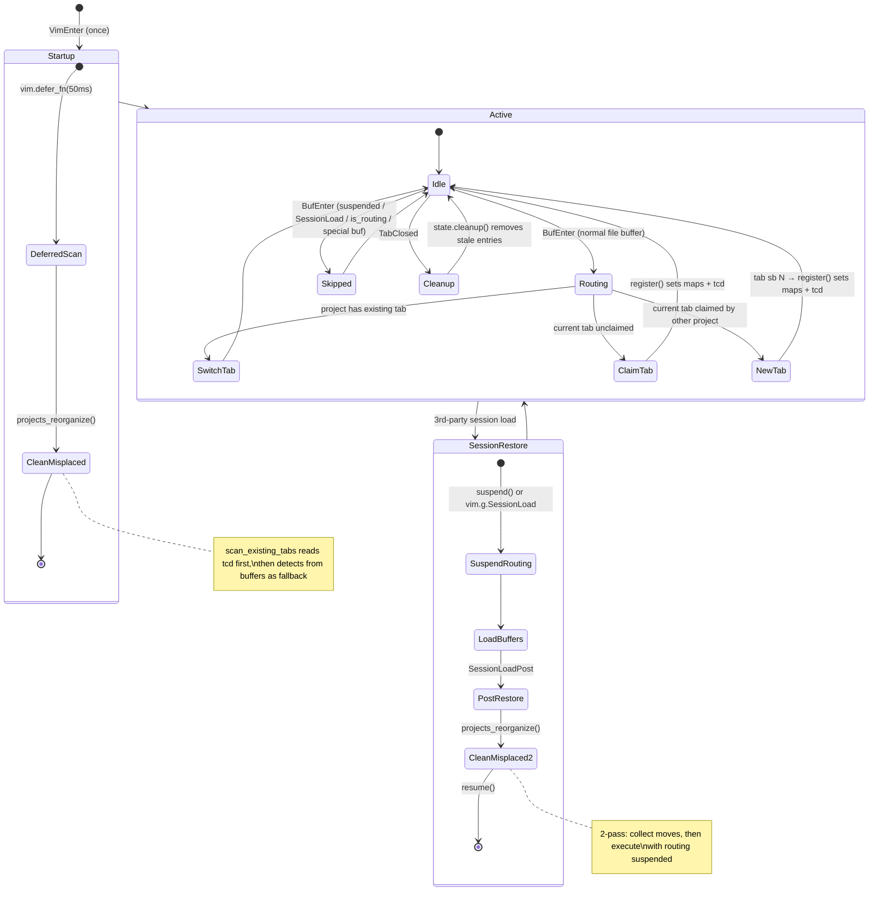

# ProjecTab — Project Tab Management for Neovim

## Overview

Automatically route buffers to their project's tab, enforcing the **"1 project = 1 tab"** rule.

- When you open a file that belongs to a project, it is displayed in that project's tab.
- If no tab exists for the project yet, the current tab is claimed (if unclaimed) or a new tab is created.
- The tab's local working directory (`tcd`) is always set to the project root.
- Special buffers (quickfix, help, terminal, etc.) are never routed.
- Session restore is supported: tabs/projects are recovered from `tcd` or buffer detection.

## Requirements

- Neovim >= v0.11.6 (uses `vim.uv.fs_stat`, `vim.uv.fs_realpath`)
- Optional dependencies:
  - **`ahmedkhalf/project.nvim`** — Advanced project root detection (fallback to native detection if absent)
  - **`akinsho/bufferline.nvim`** — Dynamic buffer grouping by project per tab
  - **`folke/snacks.nvim`** — Project picker via `snacks.picker.projects` and dashboard section
- All comments are written in English.

## Setup

```lua
require("projectab").setup({
  ui = {
    dashboard = {
      -- Built-in startup dashboard. Disable when using snacks.nvim dashboard.
      enabled = false,
      header = { "ProjecTab" },
    },
  },

  project = {
    -- Marker files/directories used to detect project roots.
    -- Detection uses "nearest root wins" — walks upward from the file's
    -- directory and returns the first (deepest) match.
    root_markers = {
      ".git", ".hg", ".svn", ".bzr", ".jj", "_darcs",
      ".mise", ".mise.toml", ".python-version", ".tool-versions", "mise.toml",
      "go.mod", "build.gradle", "build.xml", "pom.xml",
      "package.json", "pyproject.toml", "uv.toml",
      "Gemfile", "Cargo.toml",
    },

    -- Directories to exclude from root detection
    excluded_root_dirs = {},

    -- persistence settings
    persistence = {
      enabled = true,  -- save/restore buffer list per project
      dir = nil,       -- defaults to stdpath("data") .. "/projectab"
    },

    -- Function used to prompt the user for a directory when opening a new project.
    -- Signature: fun(opts: {prompt: string, completion?: string}, callback: fun(input: string?))
    -- directory_picker_func = vim.ui.input,  -- default
  },

  -- Debug logging
  debug = {
    file = false,   -- Write to stdpath("cache")/projectab.log
    notify = false, -- Show via vim.notify
  },

  -- Optional integrations
  integrations = {
    project_nvim = false,          -- Use project.nvim API for root detection
    bufferline = { enabled = false },  -- Update bufferline groups on TabEnter
    snacks = {
      enabled = false,
      pickerProjectsOpts = {},
    },
  },
})
```

## User Commands

All commands are subcommands of `:ProjecTab`. Tab completion is supported.

### Single-project commands (`p-` prefix)

| Command                        | Description                                          |
|--------------------------------|------------------------------------------------------|
| `:ProjecTab p-open <path>`     | Open a project in its own tab (or switch to it)      |
| `:ProjecTab p-pick`            | Interactive project picker (`vim.ui.select`)         |
| `:ProjecTab p-close`           | Save and close the current project tab               |
| `:ProjecTab p-save`            | Save session state for the current project tab       |
| `:ProjecTab p-restore <path>`  | Restore a single project from its saved state        |
| `:ProjecTab p-bnext`           | Next listed buffer in the current project            |
| `:ProjecTab p-bprev`           | Previous listed buffer in the current project        |

### Multi-project commands (`ps-` prefix)

| Command                          | Description                                          |
|----------------------------------|------------------------------------------------------|
| `:ProjecTab ps-list`             | List all registered projects and their tab IDs       |
| `:ProjecTab ps-save`             | Save session state for all open projects             |
| `:ProjecTab ps-restore`          | Restore all projects from persistence history        |
| `:ProjecTab ps-clear-root-cache` | Clear the root detection cache                       |
| `:ProjecTab ps-reorganize`       | Consolidate duplicate tabs, move misplaced buffers   |
| `:ProjecTab ps-close-empty-tab`  | Close tabs with only unnamed/empty buffers           |
| `:ProjecTab ps-toggle-routing`   | Toggle automatic buffer routing on/off               |

## Keymaps

The plugin provides `<Plug>` mappings for easier integration with frameworks like LazyVim, and provides a default fallback mapping.

### `<Plug>` Mappings

| `<Plug>` mapping                      | Description                              |
|---------------------------------------|------------------------------------------|
| `<Plug>(projectab-pick)`              | Open interactive project picker          |
| `<Plug>(projectab-list)`              | List all registered projects             |
| `<Plug>(projectab-save)`              | Save all project states                  |
| `<Plug>(projectab-restore)`           | Restore all project states               |
| `<Plug>(projectab-save-project)`      | Save the current project state           |
| `<Plug>(projectab-restore-project)`   | Restore a single project                 |
| `<Plug>(projectab-cache-clear)`       | Clear the root detection cache           |
| `<Plug>(projectab-reorganize)`        | Reorganize tabs and buffers              |
| `<Plug>(projectab-bnext)`             | Next buffer in project                   |
| `<Plug>(projectab-bprevious)`         | Previous buffer in project               |

### Default Fallback Mappings

| Key               | Mode | Target                              | Description                     |
|-------------------|------|-------------------------------------|---------------------------------|
| `<leader><TAB>p`  | n    | `<Plug>(projectab-pick)`            | Open interactive project picker |
| `<leader><TAB>l`  | n    | `<Plug>(projectab-list)`            | List all registered projects    |
| `<leader><TAB>S`  | n    | `<Plug>(projectab-save)`            | Save all project states         |
| `<leader><TAB>R`  | n    | `<Plug>(projectab-restore)`         | Restore all project states      |
| `<leader><TAB>s`  | n    | `<Plug>(projectab-save-project)`    | Save the current project state  |
| `<leader><TAB>r`  | n    | `<Plug>(projectab-restore-project)` | Restore a single project        |
| `<leader><TAB>c`  | n    | `<Plug>(projectab-cache-clear)`     | Clear the root detection cache  |
| `<leader><TAB>F`  | n    | `<Plug>(projectab-reorganize)`      | Reorganize tabs and buffers     |
| `<leader><TAB>]`  | n    | `<Plug>(projectab-bnext)`           | Next buffer in project          |
| `<leader><TAB>[`  | n    | `<Plug>(projectab-bprevious)`       | Previous buffer in project      |

Default keymaps are only set if not already mapped by the user. If you are using a framework like LazyVim, you can map your preferred keys directly to these `<Plug>` mappings in your plugin configuration.

## Public API

### Routing Control

For session managers or bulk-buffer utilities that don't set `vim.g.SessionLoad`:

```lua
local projectab = require("projectab")

-- Suspend automatic BufEnter routing
projectab.suspend()

-- ... perform bulk operations (session restore, etc.) ...

-- Resume normal routing
projectab.resume()
```

### Programmatic Project Management

```lua
-- Open/switch to a project tab
require("projectab.session").project_open("/path/to/project", {
  callback = function(tab_id)
    -- Runs after the tab is ready
  end,
})

-- Open/switch to a project tab (skip opening the file — useful during restore)
require("projectab.session").project_open("/path/to/project", { edit = false })

-- Open interactive picker
require("projectab.ui.pick").project_pick()

-- Access internal state (for debugging)
require("projectab")._get_state()
```

## snacks.nvim Integration

ProjecTab provides two integration points with [folke/snacks.nvim](https://github.com/folke/snacks.nvim):
a **project picker** (`snacks.picker.projects`) and a **dashboard section**.

### Project Picker (`snacks.picker.projects`)

When `integrations.snacks.enabled = true`, the `:ProjecTab p-pick` command
and `<Plug>(projectab-pick)` keymap offer a "🍿 Open project using Snacks..."
option that delegates to `snacks.picker.projects`.

The picker opens a fuzzy-searchable list of recent and discovered projects,
then calls `session.project_open()` on the selected entry and launches
`snacks.picker.files()` in that project's tab.

Options in `pickerProjectsOpts` are forwarded directly to
`snacks.picker.projects()`. See the
[snacks picker docs](https://github.com/folke/snacks.nvim/blob/main/docs/picker.md#projects)
for all available fields (`recent`, `max_depth`, `dev`, etc.).

```lua
-- lazy.nvim example
{
  "aki-s/ProjecTab.nvim",
  dependencies = { { "folke/snacks.nvim", optional = true } },
  opts = {
    integrations = {
      snacks = {
        enabled = true,
        -- Forwarded to snacks.picker.projects()
        -- ref. https://github.com/folke/snacks.nvim/blob/main/docs/picker.md#projects
        pickerProjectsOpts = {
          recent    = true,
          max_depth = 3,
          dev = {
            "~/git.d/github.com/",
            "~/git.d/gitlab.com/",
          },
        },
      },
    },
  },
}
```

### Dashboard Section (`snacks.dashboard`)

`require("projectab.integrations.snacks").dashboard_section(opts)` returns a
generator function compatible with the snacks.nvim dashboard `sections` list.
It reads ProjecTab's MRU history and renders each project as a selectable item.
Selecting an item calls `session.project_restore()`.

See the [snacks dashboard docs](https://github.com/folke/snacks.nvim/blob/main/docs/dashboard.md)
for the full section schema.

```lua
-- Inside your snacks.nvim opts.dashboard.sections list:
{
  pane    = 1,
  height  = 10,
  indent  = 2,
  padding = 1,
  title   = "ProjecTab",
  -- Returns a list of snacks.dashboard.Item entries (one per project in MRU)
  require("projectab.integrations.snacks").dashboard_section({ limit = 10 }),
},
-- Optional: add a keyed action to restore all projects at once
{
  pane   = 1,
  key    = "R",
  title  = "ProjecTab: restore all projects",
  action = function()
    require("projectab.session").projects_restore({ limit = 3 })
  end,
},
```

`dashboard_section` options:

| Field    | Type     | Default | Description                                      |
|----------|----------|---------|--------------------------------------------------|
| `limit`  | `number` | `5`     | Maximum number of projects to show               |
| `action` | `fun(dir: string)` | `nil` | Override the item action (default: `project_restore`) |

## Architecture

### Design Principles

1. **"1 project = 1 tab" rule** — Each project root maps to exactly one tab.
2. **tcd as persistence, maps as runtime cache** — `register()` is the single
   entry point that sets both the bidirectional maps and `tcd`. After session
   restore, maps are rebuilt from `tcd` (preserved by `:mksession`) with
   buffer detection as fallback.
3. **Root detection cache** — `detect.get_root()` caches results per directory.
   Cache hit is O(1), eliminating repeated `fs_stat` syscalls on BufEnter.
4. **Reentrancy safety** — Module-local `is_routing` lock prevents recursive
   BufEnter cascades. `suspend()`/`resume()` API for bulk operations.

### Dependency Graph

```mermaid
graph TD
    init["init.lua (Public API)"] --> config["config.lua (Options)"]
    init --> state["state.lua (Project↔Tab Map)"]
    init --> buffer["buffer.lua (Routing)"]
    init --> log["log.lua (Logging)"]

    subgraph init_sub ["init/ (Setup)"]
        autocmd["autocmd.lua (Autocmds)"]
        command["command.lua (User Commands)"]
        keymap["keymap.lua (Keymaps)"]
    end

    init --> autocmd
    init --> command
    init --> keymap

    autocmd --> buffer
    autocmd --> cleanup["cleanup.lua (Tab Cleanup)"]
    autocmd --> session["session.lua (Save/Restore)"]
    autocmd --> state

    command --> session
    command --> navigate["navigate.lua (Buffer Nav)"]
    command --> cleanup

    buffer --> state
    buffer --> detect["detect.lua (Root Detection + Cache)"]
    buffer --> config
    buffer --> log

    session --> persistence["persistence.lua (JSON I/O)"]
    session --> state

    cleanup --> state
    cleanup --> buffer

    navigate --> state
    navigate --> buffer

    subgraph ui_sub ["ui/ (Built-in UI)"]
        tabline["tabline.lua"]
        winbar["winbar.lua"]
        dashboard["dashboard.lua"]
        pick["pick.lua"]
    end

    autocmd -.-> dashboard
    autocmd -.-> winbar
    command -.-> pick

    tabline --> state
    dashboard --> state
    dashboard --> session
    pick --> session

    subgraph Integrations ["integrations/ (Optional)"]
        bufferline_int["bufferline.lua (UI Groups)"]
        project_nvim_int["project_nvim.lua (Root Detect)"]
        snacks_int["snacks.lua (Picker + Dashboard)"]
    end

    autocmd --..-> bufferline_int
    buffer --..-> project_nvim_int
    pick --..-> snacks_int

    bufferline_int --> state
    bufferline_int --> detect
    bufferline_int --> log
    snacks_int --> session
```

### Modules

| Module | Responsibility |
|--------|---------------|
| **`init.lua`** | Public entry point. Exports `setup()`, `suspend()`, `resume()`, `_get_state()`. Delegates setup to `init/` sub-modules. |
| **`init/autocmd.lua`** | Registers autocmds: `BufEnter` (routing), `BufWinEnter` (winbar), `SessionLoadPost` (cleanup), `TabEnter` (bufferline), `VimEnter once` (startup scan + dashboard), `TabClosed` (state cleanup), `VimLeavePre` (save). |
| **`init/command.lua`** | Registers `:ProjecTab` user command with all subcommands and tab-completion. |
| **`init/keymap.lua`** | Registers `<Plug>` mappings and default fallback keymaps. |
| **`state.lua`** | Bidirectional mapping (`project_to_tab` ↔ `tab_to_project`). `register()` is the **single entry point** for state mutation + tcd setting. `scan_existing_tabs()` reads tcd (priority 1) then detects from buffers (priority 2). |
| **`buffer.lua`** | Buffer routing on `BufEnter`. Guards: `is_suspended`, `vim.g.SessionLoad`, `is_routing` (reentrancy), `buftype`. Resolves project root, allocates buffer to correct tab. `clean_misplaced_buffers()` uses 2-pass: collect then execute. |
| **`detect.lua`** | Native project root detection. Walks upward from file directory, checking `fs_stat` for marker files. Results cached per directory. `clear_cache()` for manual invalidation. |
| **`config.lua`** | Default options and user config merge. Structured as `project.*`, `ui.*`, `debug`, `integrations.*`. |
| **`log.lua`** | Debug logging. Early-returns when disabled (no string allocation on hot path). |
| **`session.lua`** | Save/restore project state (buffer list, active buffer) per project. `project_open()` creates or switches to a project tab. `projects_save()` / `projects_restore()` for bulk operations. |
| **`persistence.lua`** | JSON file I/O and path encoding for project state storage. Dashboard MRU history. |
| **`cleanup.lua`** | `projects_close_empty_tab()` and `projects_reorganize()` (consolidate duplicate tabs + move misplaced buffers). |
| **`navigate.lua`** | Project-scoped buffer navigation: `project_bnext()` / `project_bprevious()` constrained to the current project. |
| **`health.lua`** | `:checkhealth projectab` — verifies Neovim version, config, integrations, persistence. |
| **`ui/tabline.lua`** | Built-in tabline renderer (used when `integrations.bufferline.enabled = false`). |
| **`ui/winbar.lua`** | Per-window winbar showing project root context. |
| **`ui/dashboard.lua`** | Standalone startup dashboard listing recent projects. |
| **`ui/pick.lua`** | `vim.ui.select` project picker with history and optional snacks integration. |
| **`integrations/project_nvim.lua`** | Optional: Uses `project.nvim` API for root detection. |
| **`integrations/bufferline.lua`** | Optional: Dynamically groups buffers by project in bufferline on TabEnter. Uses lazy require for `buffer.lua` to avoid circular dependency. |
| **`integrations/snacks.lua`** | Optional: `pick_new_project()` wraps `snacks.picker.projects`; `dashboard_section()` returns a snacks dashboard item generator reading ProjecTab MRU history. |

### State Lifecycle



### Root Detection Cache

Root detection results are cached per directory (not per file). All files in
the same directory share one cache entry.

```
Cache key:   directory path (file's parent dir, normalized)
Cache value: string (root path) | false (no root found)

nil  → cache miss → run fs_stat traversal → store result
false → cached negative (no root exists here)
"..."  → cached positive root path
```

Clear manually with `:ProjecTab ps-clear-root-cache` or `require("projectab.detect").clear_cache()`.
